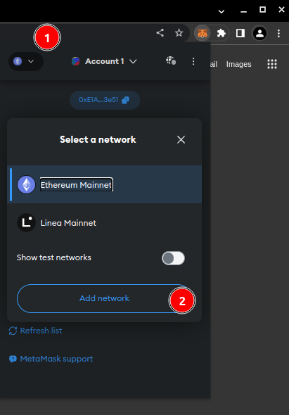
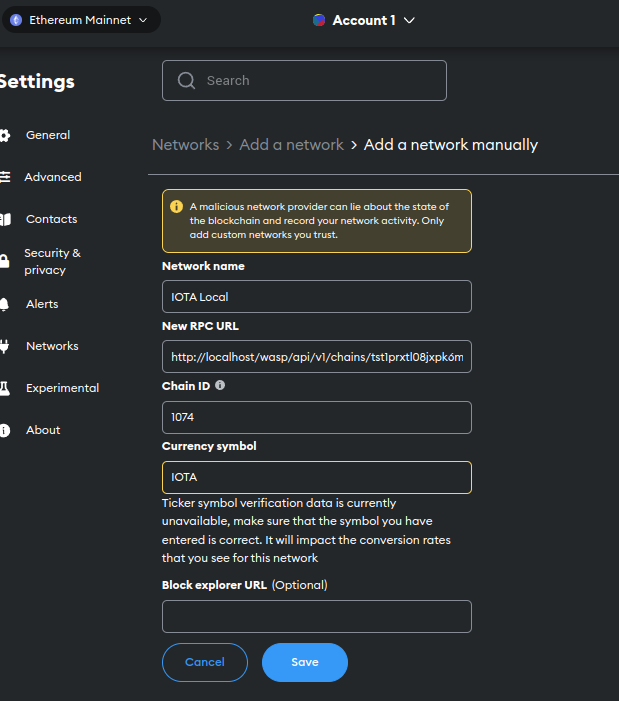
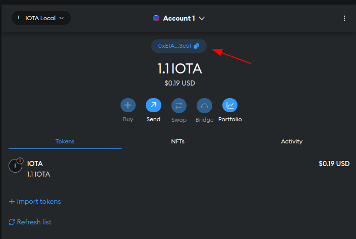
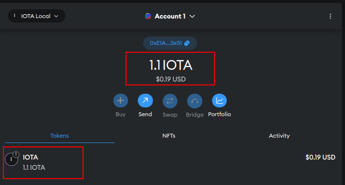

# IOTA private tangle guide

This document describes how to run the implementation of smart contract on IOTA private tangle

## Setup the private tangle

- Clone repository with WASP node. WASP node allows to run L2 EVM chain on the top of IOTA tangle

```bash
  git clone https://github.com/iotaledger/wasp && cd wasp
```

- build & install `wasp-cli` that allows you to interact with the EVM chain

If you don't have installed GO, please follow this instruction <https://go.dev/doc/install>

```bash
make build-cli && make install-cli
```

- go to the folder that allows you to start the local version of WASP with IOTA tangle

```bash
cd tools/local_setup
```

- follow all the installation step from <https://github.com/iotaledger/wasp/blob/develop/tools/local-setup/README.md>. After installation you should be able to access two dashboards:
  - IOTA Tangle L1: <http://localhost/dashboard/>
  - WASP L2: <http://localhost/wasp/dashboard>

- install Metamask extension in your browser by following instruction from <https://metamask.io/download/>

- to add a new network click then 'networks' button and then 'Add Network'

  

- click 'Add Network Manually'.
  RPC Url and chain ID you can take from Wasp dashboard <http://localhost/wasp/dashboard>

  

  Click 'save' and Metamask will automatically create account for you ( `0x...`)

- copy your account address from metamask transfer there base tokens. ccount using `wasp-cli`.

  

```bash
wasp-cli chain deposit [your address] base:1000000
```

- after while you should see some tokens available on your account

  

- edit the two files with your own data:
  - `smart-contract-templates/truffle-config.js`
  - `test/test-iota.js`
